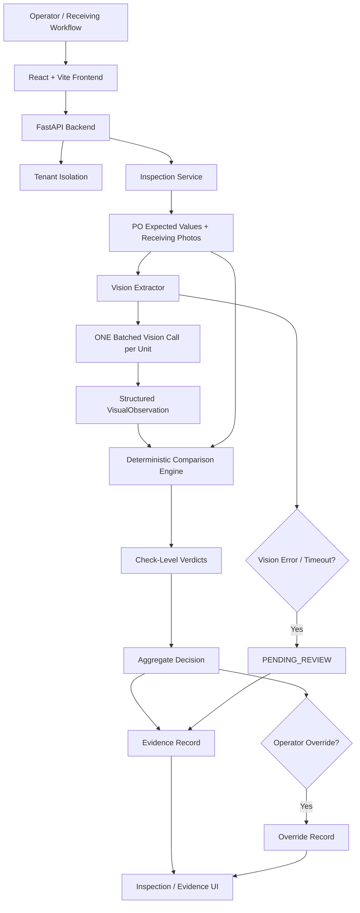

# Receiving Manager — RCV#1
## AI-Powered Receiving Inspection and Exception Management

### 1. Overview

Receiving Manager is an AI-assisted receiving inspection system for verifying whether received inventory matches purchase-order (PO) expectations and for recording evidence when exceptions occur.

The system deliberately separates responsibilities:

> **AI for observation. Rules for decisions. Humans for exceptions.**

The vision layer extracts observations from receiving photographs. A deterministic comparison engine compares those observations with expected PO/specification values and produces check-level and aggregate verdicts.

Supported outcomes:

- **PASS** — evidence satisfies the applicable check.
- **FAIL** — evidence shows a mismatch or visible issue.
- **UNCERTAIN** — evidence is insufficient or ambiguous for a reliable PASS/FAIL decision.
- **PENDING_REVIEW** — processing could not complete, such as a vision-provider timeout or malformed provider response; the record is retained for operator review.

---

## 2. Problem Scope

The system is designed for receiving inspections where an operator provides:

- Purchase-order / expected product information
- Product identity information such as SKU/ASIN
- Expected colour/variant/components
- Expected carton and quantity information
- Receiving photographs
- Operator and organization context

The system evaluates:

1. **Identity**
2. **Quantity**
3. **Carton condition**
4. **Unit condition**
5. **Specification**

The system is intentionally designed so ambiguous visual evidence is not forced into PASS or FAIL.

---

## 3. High-Level Architecture



### Main layers

| Layer | Responsibility |
|---|---|
| Frontend | Receiving workflow, inspection creation, result display, evidence display, pending review, history, overrides |
| FastAPI backend | API, request validation, inspection lifecycle, tenant isolation, orchestration |
| Agent layer | Vision observation extraction and inspection orchestration |
| Comparison engine | Deterministic PO/specification comparison |
| Evidence contract | Structured and traceable inspection record |
| Evaluation layer | Held-out evaluation framework, agreement metrics, failure-mode analysis, honesty guard |
| Demo layer | Reproducible PASS/FAIL/UNCERTAIN/PENDING_REVIEW scenarios for demonstration only |

---

## 4. Frontend Architecture

The frontend is implemented as a React application built with Vite.

Main views:

- Dashboard
- New Inspection
- Inspection List
- Inspection Result
- Pending Review
- Inspection History

Responsibilities:

1. Collect inspection information.
2. Submit inspection data to the backend.
3. Run an inspection.
4. Display expected versus observed values.
5. Display individual check results.
6. Display evidence references and metadata.
7. Highlight `PENDING_REVIEW` records.
8. Allow an operator to submit an override with a reason.
9. Display the original result and operator final decision separately.
10. Preserve the distinction between demonstration scenarios and evaluation results.

The frontend sends organization context using the `X-Org-ID` request header.

---

## 5. Backend Architecture

The backend is implemented using FastAPI and Pydantic.

### Core API

```text
GET  /health

POST /api/v1/inspections
POST /api/v1/inspections/{inspection_id}/run

GET  /api/v1/inspections/{inspection_id}
GET  /api/v1/inspections

POST /api/v1/inspections/{inspection_id}/override
```

The demo environment additionally exposes deterministic demo-seeding/reset functionality.

Backend responsibilities:

- Validate incoming inspection payloads.
- Apply organization/tenant isolation.
- Persist inspection records.
- Orchestrate the inspection agent.
- Retain photo references and metadata when vision processing fails.
- Return structured inspection results.
- Store original verdicts and operator overrides.
- Expose inspection history and pending-review records.

---

## 6. Agent Architecture

The agent is split into two stages.

### Stage A — Vision observation

The vision extractor receives the expected receiving context and physical photographs.

It performs **one batched multimodal model invocation per receiving unit** covering the required visual checks.

The output is converted into a structured `VisualObservation`.

The vision layer is an **evidence extractor**, not the final policy/decision layer.

### Stage B — Deterministic comparison

The structured observations are passed to the comparison engine.

The comparison engine applies explicit rules against the expected PO/specification values.

This keeps final comparison logic reproducible and testable.

---

## 7. Single-Batch Vision Invocation

A key architectural requirement is:

> **One batched model call per unit, covering all receiving checks.**

The system does not make separate model calls for identity, quantity, carton damage, unit damage, colour/variant, or components.

Instead, the required observations are requested together and represented in the structured observation object.

This reduces unnecessary model calls and makes the inspection flow easier to test and reason about.

---

## 8. Structured Observation Model

The vision stage produces observations corresponding to the receiving evidence.

Representative fields include:

- OCR text
- Identified SKU/barcode
- Cartons counted
- Units per carton counted
- Quantity counted
- Carton damage
- Unit damage
- Observed colour
- Observed variant
- Observed components
- Image clarity

The observation layer may represent uncertainty when evidence is insufficient.

Examples:

- Barcode glare prevents reliable SKU identification → identity can become `UNCERTAIN`.
- Motion blur prevents reliable damage assessment → relevant damage check can become `UNCERTAIN`.
- A required component is visibly absent → specification check can become `FAIL`.

---

## 9. Deterministic Comparison Engine

The comparison engine compares expected values against observed values.

### Expected values

- SKU
- ASIN
- Product title
- Specification colour
- Specification variant
- Required components
- Cartons ordered
- Units per carton ordered
- Quantity ordered

### Observed values

- OCR text
- Identified SKU/barcode
- Cartons counted
- Units per carton counted
- Quantity counted
- Carton condition
- Unit condition
- Observed colour/variant
- Observed components
- Image clarity

### Check-level decisions

The engine produces check-level outcomes for:

- Identity
- Quantity
- Carton condition
- Unit condition
- Specification

The aggregate result is derived from structured checks rather than an unconstrained model-generated final answer.

---

## 10. Verdict Semantics

### PASS

Evidence supports the expected condition.

```text
Expected quantity: 24
Observed quantity: 24
Quantity verdict: PASS
```

### FAIL

Evidence shows a concrete mismatch or visible issue.

```text
Expected quantity: 24
Observed quantity: 22
Quantity verdict: FAIL
```

### UNCERTAIN

Evidence is insufficient or ambiguous.

```text
Expected SKU: BLUE-BOTTLE-001
Observed barcode: unreadable because of glare
Identity verdict: UNCERTAIN
```

UNCERTAIN is deliberately different from PASS with low confidence.

### PENDING_REVIEW

The inspection cannot complete automatically because processing itself failed, for example:

- vision-provider timeout
- malformed provider response
- provider/configuration failure

The system retains the receiving record and photo metadata instead of discarding the inspection or blocking the workflow.

---

## 11. Evidence Record

Each inspection is represented using a structured evidence record.

Core information includes:

```text
record_id
unit_id
org_id / organization context
operator_id
captured_at

po_header
expected_values
observed_values

individual_checks
final_verdict
verdict_reason

evidence_references

operator_override (when present)
```

Evidence references can contain:

- Photo reference / URL
- View type
- SHA-256 content hash
- Bounding boxes where applicable

The evidence record is designed to make the result traceable back to the receiving evidence.

---

## 12. Operator Overrides

Operator overrides are first-class inspection data.

An override preserves:

- Original verdict
- Override verdict
- Operator ID
- Reason
- Timestamp

Example:

```text
Original inspection verdict:
FAIL

Operator final verdict:
UNCERTAIN

Reason:
Additional verification required before rejecting shipment.
```

The original result is not silently overwritten. This preserves the audit trail between automated inspection and human decision.

---

## 13. Multi-Tenant Security

Tenant isolation is treated as a security requirement rather than a UI feature.

Inspection access is scoped using organization context.

The current API supports organization identification through:

```text
X-Org-ID
```

Cross-tenant access attempts return no unauthorized inspection record.

The implementation includes tests for tenant isolation so an inspection belonging to one organization cannot simply be retrieved by another organization.

---

## 14. Fail-Open Reliability

Vision processing is not allowed to destroy the receiving record when the model provider fails.

If the provider:

- times out,
- returns invalid JSON,
- is unavailable, or
- is not configured,

the system retains the inspection/photo metadata and records:

```text
status  = pending_review
verdict = PENDING_REVIEW
```

The operator can then review the receiving case instead of the workflow silently losing the inspection.

---

## 15. Evaluation Architecture

The repository contains a dedicated evaluation framework supporting:

- PASS/FAIL/UNCERTAIN confusion matrices
- Cohen's kappa
- False-positive analysis
- False-negative analysis
- Quantity discrepancy analysis
- Named failure-mode analysis
- Uncertainty measurement
- Held-out evaluation gating

### Evaluation integrity

The starter synthetic CSV is **not** treated as official ground truth.

Official vision metrics are only reported when the evaluation dataset satisfies the required conditions, including:

```text
dataset_status = held_out
annotation_status = dual_independent
```

The evaluation framework therefore refuses to present unsupported official accuracy or precision claims.

### Required held-out evaluation

The build documentation follows the competition requirement for an unseen evaluation set with:

- At least 50 unseen units for the applicable vision track
- Two independent human evaluators
- Agreement measurement using Cohen's kappa
- Per-check performance
- FP/FN analysis
- UNCERTAIN analysis
- Failure-mode analysis

At the current implementation stage, official held-out vision metrics are **not claimed** because the required real photographed evaluation set and independent annotations are not bundled with the implementation.

---

## 16. Known Failure Modes

The evaluation framework tracks representative receiving-vision failure modes:

| ID | Failure mode |
|---|---|
| FM-01 | Barcode Glare |
| FM-02 | Motion Blur |
| FM-03 | Concealed Unit Damage |
| FM-04 | Nested Bundles |
| FM-05 | Occluded Labels |

These failure modes structure evaluation and explain where visual evidence can become ambiguous.

---

## 17. Demo Architecture

The project includes deterministic demonstration scenarios.

### DEMO-PASS-001

```text
Expected quantity: 24
Observed quantity: 24
Condition: clean
Final result: PASS
```

### DEMO-FAIL-001

```text
Expected quantity: 24
Observed quantity: 22
Carton condition: crushing detected
Final result: FAIL
```

### DEMO-UNCERTAIN-001

```text
Evidence: insufficient / ambiguous
Example issue: barcode glare / low image clarity
Final result: UNCERTAIN
```

### DEMO-PENDING-001

```text
Simulated provider failure
Photo/metadata retained
Final status: PENDING_REVIEW
```

These scenarios are for reproducible product demonstration and workflow verification.

**They are not official evaluation results and are not presented as measured model accuracy.**

---

## 18. Testing Strategy

Testing covers the major layers.

### Agent / comparison layer

- Clean PASS
- Short shipment
- Wrong SKU
- Uncertain SKU
- Carton crushing
- Unclear damage
- Wrong variant
- Missing component
- Provider timeout
- Invalid provider response
- Single-call invocation behavior

### Backend layer

- API health
- Inspection creation
- Inspection retrieval
- Inspection listing
- Inspection execution
- Tenant isolation
- Pending-review behavior
- Operator overrides
- CORS behavior
- Demo seed/reset behavior

### Frontend layer

- Core UI components
- Inspection workflow
- Result rendering
- Status rendering
- Pending review
- Override workflow
- History/list behavior

The automated test suite was used during development to validate the implemented layers and demo workflow.

---

## 19. Technology Stack

### Frontend

- React
- TypeScript
- Vite

### Backend

- Python
- FastAPI
- Pydantic
- Uvicorn

### Agent / AI layer

- Python-based inspection agent
- Structured visual observation model
- Configurable vision-provider interface
- Deterministic comparison engine

### Testing / Evaluation

- Pytest
- Frontend test suite
- Cohen's kappa and evaluation metrics implementation

The architecture keeps the vision-provider integration separate from deterministic receiving rules.

---

## 20. Repository Structure

```text
submissions/cherryy-x23/
├── agent/
│   ├── core/
│   │   ├── agent.py
│   │   ├── comparison_engine.py
│   │   ├── models.py
│   │   └── vision_extractor.py
│   ├── eval/
│   │   ├── metrics.py
│   │   ├── run_eval.py
│   │   ├── ground_truth.json
│   │   └── fixtures/
│   └── tests/
│
├── backend/
│   ├── app/
│   │   ├── api/
│   │   ├── schemas/
│   │   ├── security/
│   │   ├── services/
│   │   ├── config.py
│   │   └── main.py
│   └── tests/
│
├── frontend/
│   ├── src/
│   │   ├── components/
│   │   ├── pages/
│   │   ├── api/
│   │   └── context/
│   ├── package.json
│   └── vite.config.ts
│
├── contract/
│   ├── evidence_record.schema.json
│   └── example_rcv_record.json
│
├── scripts/
├── README.md
├── build-brief.md
├── build-log.md
├── eval-report.md
└── ARCHITECTURE.md
```

---

## 21. Request / Decision Flow

```text
1. Operator submits PO/expected values + receiving evidence
        ↓
2. Backend validates request and organization context
        ↓
3. Inspection record is created
        ↓
4. Agent receives expected values and receiving photographs
        ↓
5. ONE batched vision call extracts observations
        ↓
6. Structured observations are validated
        ↓
7. Deterministic comparison engine evaluates each check
        ↓
8. Aggregate verdict is produced
        ↓
9. Evidence record is persisted
        ↓
10. Frontend displays result and supporting evidence
        ↓
11. Operator may override with reason
        ↓
12. Original and final decisions remain traceable
```

Failure path:

```text
Vision provider
      ↓
timeout / malformed response / unavailable
      ↓
retain receiving evidence
      ↓
PENDING_REVIEW
      ↓
operator review
```

---

## 22. Design Decisions

### Why use AI for observation instead of final decisions?

Receiving decisions depend on exact PO values and deterministic business rules. Separating observation from comparison makes those rules explicit, testable, and easier to audit.

### Why support UNCERTAIN?

Photographs can contain glare, blur, occlusion, or concealed damage. A system that always chooses PASS or FAIL would hide evidence limitations.

### Why preserve operator overrides?

Human review is necessary for exceptions and ambiguous cases. Recording both decisions preserves traceability rather than silently replacing the automated result.

### Why fail open?

A vision-provider failure should not cause the receiving record to disappear or make the receiving workflow stall. `PENDING_REVIEW` allows the case to continue to an operator.

### Why separate demo data from evaluation data?

Demonstration scenarios prove workflow behavior. They do not establish model accuracy. Official performance must come from an unseen, independently annotated evaluation set.

---

## 23. Current Limitations

1. The starter repository does not contain the required real photographed receiving dataset.
2. The synthetic sample CSV is not treated as official visual ground truth.
3. Official held-out vision accuracy metrics are therefore not claimed.
4. The evaluation framework is ready for the required dual-annotator held-out dataset.
5. Live vision-provider performance depends on the configured provider and available receiving photographs.
6. Demo scenarios are deterministic workflow fixtures and should not be interpreted as production model performance.
7. Deployment configuration is environment-specific and should be supplied separately from local development configuration.

These limitations are documented rather than hidden behind unsupported metrics.

---

## 24. Security and Reliability Summary

The architecture prioritizes:

- Organization-scoped access
- Structured request validation
- Evidence traceability
- Explicit uncertainty
- Fail-open provider handling
- First-class human overrides
- Deterministic comparison rules
- Single batched vision invocation
- Automated regression testing
- Honest evaluation gating

An inspection remains explainable through:

```text
Expected values
      +
Observed evidence
      +
Individual checks
      +
Decision reason
      +
Evidence references
      +
Optional operator override
```

---

## 25. Reproducibility

The repository contains the application source, tests, evaluation framework, evidence contract, documentation, and deterministic demo scenarios required to reproduce the implemented workflow.

Environment-specific secrets and `.env` files are intentionally excluded from version control.

---

## 26. Summary

Receiving Manager implements an evidence-first receiving workflow:

```text
PO + Receiving Photos
          ↓
   Batched Vision AI
          ↓
Structured Observations
          ↓
Deterministic Rules
          ↓
PASS / FAIL / UNCERTAIN
          ↓
Evidence Record
          ↓
Human Override when required
```

The core architectural principle is:

> **Use vision AI to extract what is visible, deterministic rules to compare what was expected against what was observed, and human operators to resolve exceptions.**
