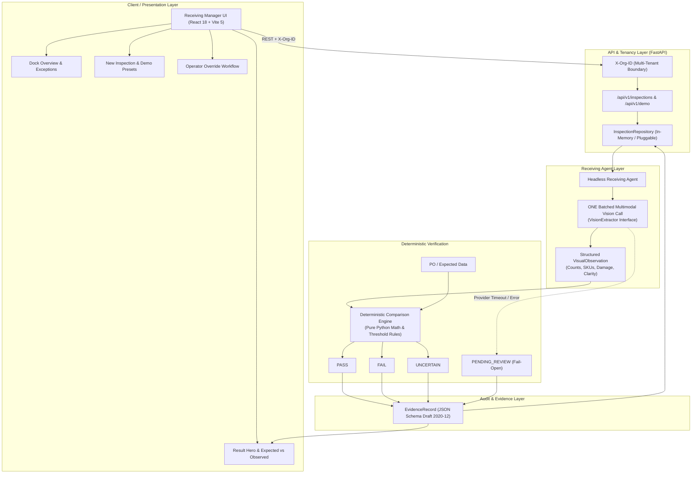

# cherryy-x23 — CUBE Receiving Manager

**Commerce Context Stream — Round 2 — Pod 01: Receiving Manager**

## Problem Statement
In physical commerce fulfillment, supplier disputes originate at the receiving dock. Pallets arrive with crushed cartons, water damage, wrong SKUs, missing components, or short unit counts. Today, warehouse receivers spot-check pallets under time pressure without creating verifiable digital records. Shortages and defects surface weeks later during prep or customer returns, when claims against suppliers are unwinnable.

The **Receiving Manager** observes goods on arrival using multimodal vision AI, deterministically verifies them against purchase order specifications, and generates an auditable, immutable **Evidence Record** (`RCV-XXXX`) linked to `unit_id` for downstream prep, return, and financial recovery operations.

---

## Current Status: Phase 6 Complete (Demo Hardening + Final Submission Preparation)
- **Phase:** Phase 6 — Demo Hardening + Final Submission Preparation.
- **Demo Scenario System:** 4 isolated scenarios (`DEMO-PASS-001`, `DEMO-FAIL-001`, `DEMO-UNCERTAIN-001`, `DEMO-PENDING-001`) with one-click presets on the frontend and CLI seed script.
- **Fail-Open Operational Safety:** Vision timeouts or provider outages safely route to `PENDING_REVIEW` with dock evidence preserved, ensuring dock workflows never halt.
- **Tenant Isolation:** Enforced via `org_id` context (`X-Org-ID` header and query param); cross-tenant access returns `404 Not Found` to prevent leaking record existence.
- **Operator Overrides:** Interactive override workflow preserving original AI verdicts while recording operator ID and mandatory audit rationale.
- **Official Model Accuracy:** **NOT YET AVAILABLE** (strictly waiting for physical held-out captures and dual human annotators; zero metrics fabricated).
- **Automated Tests:** **70 tests passing** (37 agent/eval tests + 17 backend tests + 16 frontend tests).
- **Frontend Production Build:** **PASSING** cleanly with zero TypeScript errors.

---

## System Architecture



### Core Architecture Flow
```text
PO / Expected Data + Receiving Photos
                  │
                  ▼
   ONE Batched Multimodal Vision AI Call (Per Receiving Unit)
                  │
                  ▼
     Structured VisualObservation Schema
                  │
                  ▼
   Deterministic Comparison Engine (Pure Python Math & Rules)
                  │
       ┌──────────┼──────────┬──────────────┐
       ▼          ▼          ▼              ▼
     PASS       FAIL     UNCERTAIN    PENDING_REVIEW (Fail-Open)
       │          │          │              │
       └──────────┼──────────┴──────────────┘
                  │
                  ▼
    Schema-Valid EvidenceRecord (JSON Schema Draft 2020-12)
                  │
                  ▼
      Receiving Manager UI (React 18 + Vite 5)
                  │
                  ▼
         Operator Override (Preserves Original Verdict + Rationale)
```

### Architectural Principles:
1. **Vision AI Observes, Deterministic Code Decides:** The LLM/Vision model is strictly an evidence extractor. Arithmetic (e.g., $Cartons \times Units/Carton$), tolerance limits, and verdict rules are evaluated deterministically in pure Python.
2. **Exactly ONE Batched Vision Call:** All photos for a receiving unit are evaluated in a single batched multimodal call to avoid token cost explosion and latency.
3. **Explicit Uncertainty:** `UNCERTAIN` is a first-class result; ambiguous barcodes or blurry photos are never silently converted into weak passes.
4. **Fail-Open by Design:** If a vision provider times out or returns malformed data, dock photos and inspection records are preserved and transitioned to `pending_review` with verdict `PENDING_REVIEW`. Physical dock flow is never blocked.
5. **Tenant Isolation:** Multi-tenancy is enforced on all routes via `X-Org-ID`. Cross-tenant inspections return HTTP 404.
6. **Immutable Evidence Trail:** Every decision produces a schema-compliant `EvidenceRecord` tracking individual checks, photo hashes, and operator override history.

---

## Live Jury Demo

A comprehensive 3–5 minute timed walkthrough script is available in:
👉 **[`submissions/cherryy-x23/demo-script.md`](demo-script.md)**

### Running the Demo Locally (Windows Command Prompt)

#### Step 1: Start Backend API Server
```cmd
cd submissions\cherryy-x23
python -m uvicorn app.main:app --app-dir backend --port 8000
```
* Backend API documentation available at: `http://localhost:8000/docs`

#### Step 2: Start Frontend Application
In a second terminal:
```cmd
cd submissions\cherryy-x23\frontend
npm install
npm run dev
```
* Frontend available at: `http://localhost:5173`

#### Step 3: Seed Demo Scenarios
You can seed demo scenarios in any of three ways:
1. **Frontend UI:** On the Dashboard (`http://localhost:5173`), click **"⚡ [DEMO] Seed 4 Scenarios"**.
2. **CLI Script:** In a third terminal:
   ```cmd
   python submissions\cherryy-x23\scripts\seed_demo_scenarios.py
   ```
3. **REST API Endpoint:** Send `POST http://localhost:8000/api/v1/demo/seed` with header `X-Org-ID: org_demo_alpha`.

---

## Demo Scenarios Walkthrough

The demo scenario system is strictly segregated from official evaluation fixtures using `DEMO-*` prefixes:

| Scenario | Record ID | Condition | Expected Result | What to Observe in UI |
|---|---|---|---|---|
| **1. Clean Pass** | `DEMO-PASS-001` | SKU matches, 24 units, clean master cartons | `PASS` | Green PASS hero badge; all individual checks show PASS; 24 ordered vs 24 observed. |
| **2. Shortage / Damage** | `DEMO-FAIL-001` | Ordered 24 units, observed 22 units; crushed carton | `FAIL` | Red FAIL hero badge; Quantity check fails (-2 units); Carton condition check fails (crushing). |
| **3. Uncertain Evidence** | `DEMO-UNCERTAIN-001` | Blurry photo, ambiguous barcode label | `UNCERTAIN` | Yellow UNCERTAIN badge; explicit notice that evidence was insufficient without guessing. |
| **4. Fail-Open (Provider Outage)** | `DEMO-PENDING-001` | Vision API timeout / malformed provider response | `PENDING_REVIEW` | Orange Pending Review badge; evidence photos preserved; dock operations continue uninterrupted. |

### Demonstrating Operator Override
1. Open any completed inspection (e.g., `DEMO-FAIL-001`).
2. Click **"Operator Override"** button.
3. Select new verdict (e.g., `PASS`), enter operator ID and reason (`Physical recount confirmed 24 units; exterior packaging damage did not affect goods`).
4. Click **"Confirm Override"**.
5. Observe the updated UI: The banner clearly displays that an override was applied, showing original verdict (`FAIL`), new verdict (`PASS`), operator ID, timestamp, and audit reason.

### Demonstrating Multi-Tenant Isolation
1. In the top navigation bar, toggle the tenant dropdown from `org_demo_alpha` to `org_demo_bravo`.
2. Notice that the inspection table is completely isolated—Tenant Bravo cannot see Tenant Alpha's demo records.
3. Direct API requests across tenants return HTTP 404.

---

## Deliverables Index (`submissions/cherryy-x23/`)
- [`demo-script.md`](demo-script.md): 3–5 minute timed jury presentation walkthrough.
- [`01-customer-letter.md`](01-customer-letter.md): Working-backwards narrative for warehouse operators and finance leads.
- [`02-prfaq.md`](02-prfaq.md): Press release and operational FAQ addressing edge cases.
- [`03-one-pager.md`](03-one-pager.md): Executive summary, key metrics, and kill conditions.
- [`CLAUDE.md`](CLAUDE.md): Repository and engineering rules (tenancy, single-batch calls, fail-open, no fake metrics).
- [`build-brief.md`](build-brief.md): Architectural specification, evaluation design, API design, and UI architecture.
- [`build-log.md`](build-log.md): Verifiable chronological build log (Phases 1–6).
- [`eval-report.md`](eval-report.md): Formal evaluation report distinguishing infrastructure from unpopulated real-world metrics.
- [`contract/evidence_record.schema.json`](contract/evidence_record.schema.json): Official JSON Schema Draft 2020-12 contract.
- [`contract/example_rcv_record.json`](contract/example_rcv_record.json): Synthetic short-shipment evidence record example.
- [`agent/core/models.py`](agent/core/models.py): Strongly validated Pydantic V2 domain models.
- [`agent/core/vision_extractor.py`](agent/core/vision_extractor.py): Multimodal vision extractor and mock fixture.
- [`agent/core/comparison_engine.py`](agent/core/comparison_engine.py): Pure deterministic verification logic.
- [`agent/core/agent.py`](agent/core/agent.py): Headless Receiving Agent coordinating single-batch extraction and verification.
- [`agent/cli.py`](agent/cli.py): CLI runner supporting inspection, validation, and observation verification.
- [`agent/eval/`](agent/eval/): Evaluation harness, metrics engine (`metrics.py`), and runner (`run_eval.py`).
- [`agent/tests/`](agent/tests/): 37 automated agent and evaluation tests passing.
- [`backend/app/main.py`](backend/app/main.py): FastAPI application entrypoint with local Vite CORS configuration.
- [`backend/app/api/`](backend/app/api/): API routes (`health.py`, `inspections.py`, `demo.py`).
- [`backend/app/services/`](backend/app/services/): Inspection service coordinator and repository abstraction.
- [`backend/app/security/`](backend/app/security/): Multi-tenancy isolation guard (`tenancy.py`).
- [`backend/tests/test_backend_api.py`](backend/tests/test_backend_api.py): 17 automated backend integration tests.
- [`frontend/src/`](frontend/src/): React 18 + Vite 5 frontend application.
- [`frontend/src/tests/frontend.test.tsx`](frontend/src/tests/frontend.test.tsx): 16 automated frontend integration tests.
- [`scripts/seed_demo_scenarios.py`](scripts/seed_demo_scenarios.py): CLI demo scenario seeder and reset tool.

---

## Running the Automated Test Suites (70 Tests Total)

### 1. Agent & Evaluation Test Suite (37 Tests)
```bash
python -m unittest discover -s submissions/cherryy-x23/agent/tests -p "test_*.py" -v
```

### 2. Backend API Test Suite (17 Tests)
```bash
python -m unittest discover -s submissions/cherryy-x23/backend/tests -p "test_*.py" -v
```

### 3. Frontend UI Test Suite (16 Tests)
```bash
cd submissions/cherryy-x23/frontend
npm test -- --run
```

---

## Building the Production Frontend Bundle
```bash
cd submissions/cherryy-x23/frontend
npm run build
```
Production assets are generated cleanly to `submissions/cherryy-x23/frontend/dist/`.

---

## Evaluation Status
- **Official evaluation metrics: NOT YET AVAILABLE**
- In strict adherence to CUBE rules, official precision, recall, and Cohen's Kappa metrics are left unpopulated until physical receiving photos are collected and dual-annotated.
- The evaluation harness (`agent/eval/run_eval.py`) is fully implemented and tested with 10 unit tests. It automatically prevents publishing synthetic starter data as ground-truth metrics.
